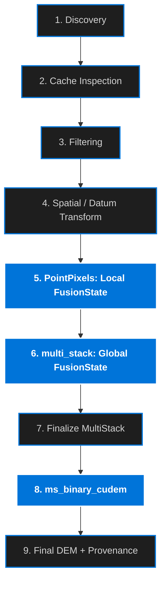
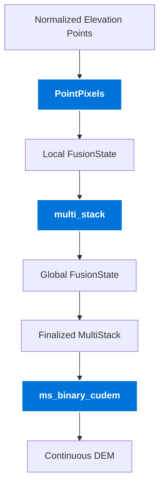

# 🌎 DEM Generation Architecture

Globato builds seamless, high-resolution Digital Elevation Models (DEMs) from heterogeneous elevation sources exposed through Fetchez. The core DEM workflow separates three responsibilities:

1. **Point-to-pixel accumulation** converts normalized elevation observations into an additive statistical state.
2. **Multi-source fusion** combines those states according to source weighting and stacking policy.
3. **Multi-resolution interpolation** fills remaining spatial gaps while preserving the detail of observed data.

The primary components are:

* `PointPixels` — converts elevation observations into an associative `FusionState`.
* `multi_stack` — combines source states into a persistent global `FusionState` and finalizes it into a statistical MultiStack.
* `ms_binary_cudem` — uses the finalized MultiStack to construct the continuous DEM through multi-resolution interpolation.

This separation allows Globato to process large datasets incrementally while retaining enough statistical state to cache, resume, and extend DEM builds without reprocessing every original observation.

See [Point-to-Pixel Fusion State](point_pixels.md) for the detailed accumulation contract.

---

## DEM Processing Workflow

A typical Globato DEM recipe follows this general lifecycle:



### 1. Data Discovery & Access

Fetchez modules discover remote or local elevation datasets and produce manifest entries describing the available resources.

Sources may include:

* bathymetric LiDAR
* topographic LiDAR
* multibeam sonar
* hydrographic surveys
* nautical chart soundings
* regional elevation grids
* global topographic or bathymetric models

Globato does not require these sources to share a common original format.

### 2. Cache Inspection

Previously fetched resources can be reused through Fetchez caches so that repeated DEM builds avoid unnecessary network access and source discovery.

Additional Globato caches may preserve processed intermediate products such as FusionState rasters.

### 3. Preparation & Filtering

Point streams can pass through hooks that:

* crop spatially
* mask land or water
* filter elevation ranges
* filter classifications
* remove invalid observations
* apply source-specific preprocessing

At this stage the stream still represents individual elevation observations.

### 4. Spatial & Datum Transformation

Coordinates and elevations are transformed into the horizontal and vertical reference systems required by the target DEM.

By the time observations reach the accumulation stage, downstream components can treat them as normalized elevation points.

---

# FusionState Accumulation

## `PointPixels`

`PointPixels` is the boundary between point observations and Globato's statistical accumulation model.

Rather than immediately calculating a mean elevation for each raster cell, `PointPixels` stores additive sufficient statistics.

For each populated pixel, the current FusionState contains:

| Band | State Field               | Meaning                |
| ---: | ------------------------- | ---------------------- |
|    1 | `z_weighted_sum`          | Σ(z × w)               |
|    2 | `count`                   | Number of observations |
|    3 | `weight_sum`              | Σw                     |
|    4 | `z2_weighted_sum`         | Σ(z² × w)              |
|    5 | `weighted_uncertainty_sq` | Σ((w × u)²)            |
|    6 | `x_weighted_sum`          | Σ(x × w)               |
|    7 | `y_weighted_sum`          | Σ(y × w)               |

These values are deliberately **not finalized averages**.

Because every field is additive, FusionState is associative:

```text
FusionState(A + B)
    ==
FusionState(A) + FusionState(B)
```

This property is central to Globato's streaming and caching architecture.

The same result can be obtained whether observations are:

* processed in one chunk
* split across many chunks
* serialized and restored
* accumulated source-by-source
* resumed from a previously saved state

Derived quantities such as weighted mean elevation, standard deviation, and propagated uncertainty are calculated only when the state is finalized.

See **Point-to-Pixel Fusion State** for the detailed contract.

---

# Multi-Source Accumulation

## `multi_stack`

The `multi_stack` hook combines local FusionStates into a global FusionState covering the target DEM region.

It performs **no interpolation**.

Its job is to decide how incoming source state interacts with state already present in each cell.

### Stacking Strategies

The stacking behavior is controlled by `strategy`.

#### `mean` / `weighted_mean`

All incoming FusionStates are added.

Because every FusionState field is additive, this operation is simply:

```text
global_state += incoming_state
```

#### `supercede`

The mean observation weight of the incoming source is compared with the existing state.

If the incoming weight is greater, the incoming FusionState replaces the existing state for that pixel.

#### `mixed`

Weights are grouped into configured tiers.

For each pixel:

* a higher incoming tier replaces the existing state
* an equal tier is merged with the existing state
* a lower tier is ignored

This allows high-priority elevation sources to supersede lower-priority background data while still combining observations of comparable quality.

---

## Persistent FusionState

The accumulator can maintain its state in a FusionState GeoTIFF.

Unlike the finalized MultiStack, this file contains the additive sufficient statistics needed to continue accumulation later.

A persisted state can therefore be:

* resumed in a later run
* extended with newly available datasets
* used as a processed-data cache
* supplied directly by other Globato components
* re-finalized without re-reading the original source observations

Persistent state is validated before reuse. Globato checks the expected grid geometry, CRS, FusionState schema version, band count, and band descriptions before accepting an existing state.

This makes the FusionState file an explicit data product rather than an opaque temporary scratch raster.

---

# Finalized MultiStack

Once accumulation is complete, the global FusionState is finalized into the user-facing MultiStack.

The finalized MultiStack contains derived statistical values rather than additive state:

| Band | Channel       | Description                              |
| ---: | ------------- | ---------------------------------------- |
|    1 | `z`           | Weighted mean elevation                  |
|    2 | `count`       | Number of accumulated observations       |
|    3 | `weight`      | Mean observation weight                  |
|    4 | `uncertainty` | Propagated input measurement uncertainty |
|    5 | `stddev`      | Observed weighted elevation dispersion   |
|    6 | `x`           | Weighted mean source X coordinate        |
|    7 | `y`           | Weighted mean source Y coordinate        |

The FusionState and finalized MultiStack are intentionally separate formats.

```text
FusionState
    additive
    resumable
    cacheable
    mergeable

        ↓ finalize

MultiStack
    derived statistics
    human/GIS consumable
    interpolation input
```

A finalized MultiStack should not be treated as accumulation state because information required for exact future merging has already been collapsed.

---

# Multi-Resolution Interpolation

## `ms_binary_cudem`

`ms_binary_cudem` converts the statistical MultiStack into a continuous elevation model.

Its purpose is to fill spatial voids while preserving observed high-resolution terrain and bathymetry wherever possible.

### Multi-Resolution Step-Down

The grid is progressively decimated into lower-resolution tiers.

At coarser resolutions:

* small data gaps become smaller relative to pixel size
* sparse observations provide broader spatial support
* interpolation can construct a stable background surface

An interpolated surface is first established at the coarsest configured tier.

### Step-Up

Globato then progresses back toward native resolution.

At each tier:

1. observed elevation data retain priority
2. unresolved gaps are inherited or interpolated from the coarser surface
3. higher-priority source information supersedes lower-resolution support
4. the result becomes the starting point for the next finer tier

The process continues until the native DEM resolution is reached.

### Why Multi-Resolution Gridding?

A single interpolation performed directly at native resolution can behave poorly when data density varies greatly.

Coastal DEMs frequently combine:

* dense LiDAR
* sparse soundings
* multibeam swaths
* regional DEMs
* large areas with no direct observations

The multi-resolution approach allows Globato to preserve dense observed detail while deriving broad-scale support only where it is needed.

### Land and Coastal Constraints

The interpolation workflow can incorporate coastline and landmask information to prevent interpolation from crossing inappropriate physical boundaries.

Additional morphological controls can constrain interpolation across coastal and near-shore gaps where unconstrained interpolation would otherwise create unrealistic terrain.

### `steps`

The `steps` option controls how many coarser resolution tiers are generated.

For example:

```yaml
steps: 3
```

produces four resolution levels:

```text
native resolution
step 1
step 2
step 3 / coarsest
```

Configuration arrays such as algorithms or blend distances may be expanded across these tiers by repeating the final configured value when necessary.

---

# Fusion and Interpolation Together

The core relationship can be summarized as:



This separation is important:

* `PointPixels` performs statistical point-to-pixel reduction.
* `multi_stack` performs source-to-source fusion.
* `ms_binary_cudem` performs spatial interpolation.

Each component operates at a different level of the DEM construction process.

---

# Provenance & Source Coverage

Globato can generate several complementary provenance products while elevation sources pass through the pipeline.

## Source Masks

Per-file source masks record whether each source contributed observations to a pixel.

These masks are generated using the same point-to-pixel geometry as FusionState accumulation, but only require a boolean coverage result.

Individual masks can be combined into a multi-band VRT for inspection in GIS software.

## Provenance Bitmask

The provenance raster stores module-level source coverage in a compact `uint32` raster.

Each source module is assigned a bit:

```text
MOD_csb       = 1
MOD_multibeam = 2
MOD_charts    = 4
MOD_tnm       = 8
```

If several modules contribute to one pixel, their values are combined using bitwise OR:

```text
pixel = source_a | source_b | source_c
```

A specific source can later be tested using bitwise AND.

## Spatial Metadata

Source masks may also be polygonized and dissolved into vector metadata products describing the spatial coverage of source datasets together with available metadata such as:

* agency
* source module
* weight
* date
* resolution
* URL

---

# Typical Output Products

A Globato DEM build may produce:

| Product                           | Purpose                                  |
| --------------------------------- | ---------------------------------------- |
| Final DEM                         | Continuous elevation surface             |
| Finalized MultiStack              | Statistical input used for interpolation |
| FusionState                       | Optional resumable accumulation state    |
| Hillshade / visualization rasters | Visual inspection                        |
| Individual source masks           | Per-file data coverage                   |
| Source-mask VRT                   | Combined source inspection               |
| Provenance raster                 | Compact module-level lineage             |
| Spatial metadata GeoPackage       | Vector representation of source coverage |

The exact filenames depend on the recipe and hook configuration.

---

# Architectural Summary

Globato's DEM engine is built around one central principle:

> Preserve additive statistical state for as long as possible, and only derive finalized values when they are actually needed.

That gives the pipeline a clean progression:

```text
observations
    ↓
FusionState
    ↓
multi-source FusionState
    ↓
finalized MultiStack
    ↓
multi-resolution interpolation
    ↓
DEM
```

This architecture allows DEM builds to remain reproducible while also supporting streaming, caching, resumable accumulation, provenance tracking, and incremental updates as new elevation data become available.
